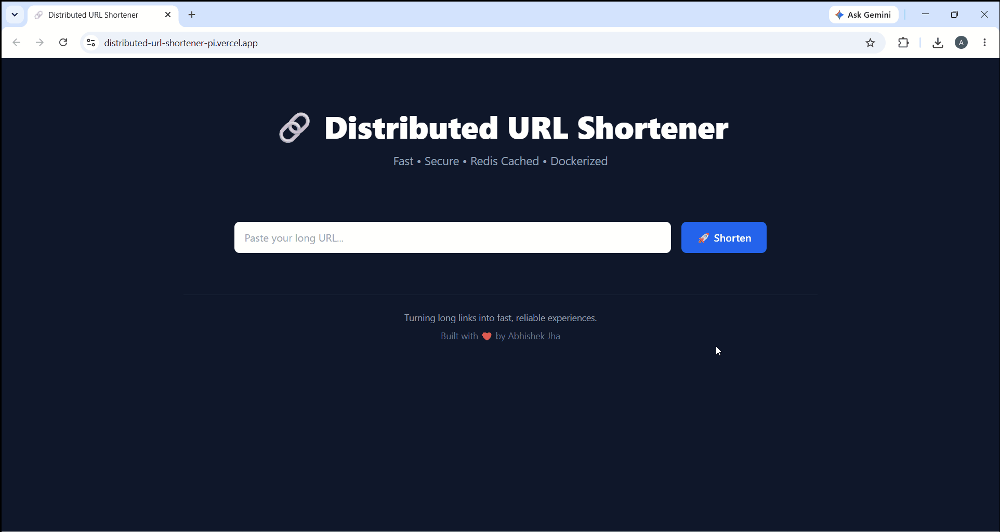
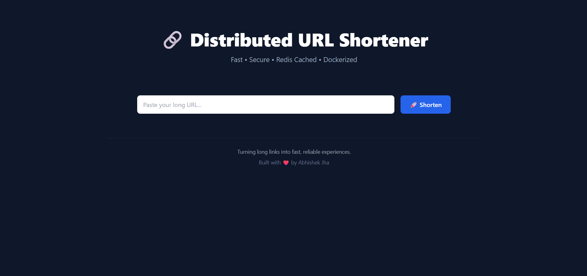
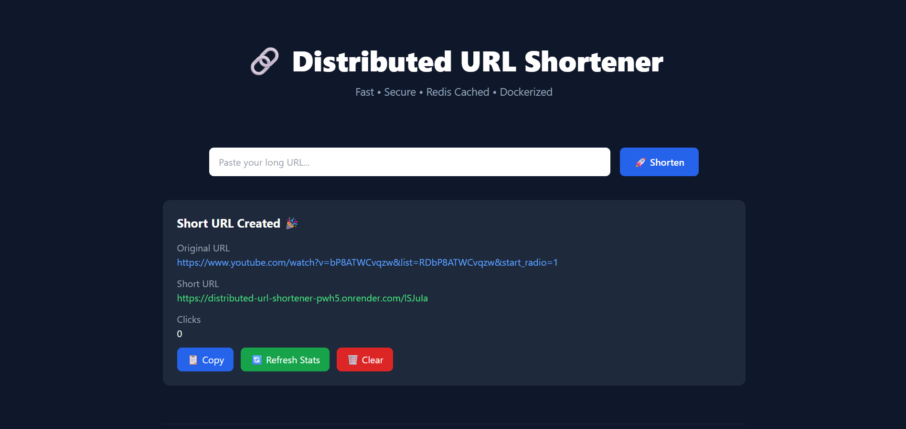
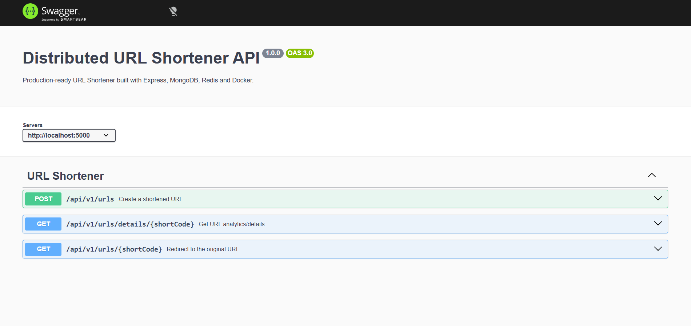
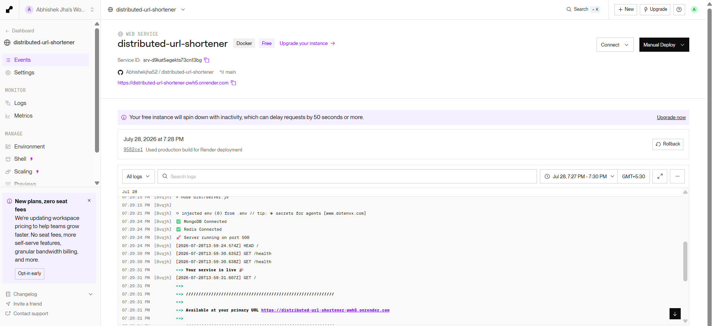
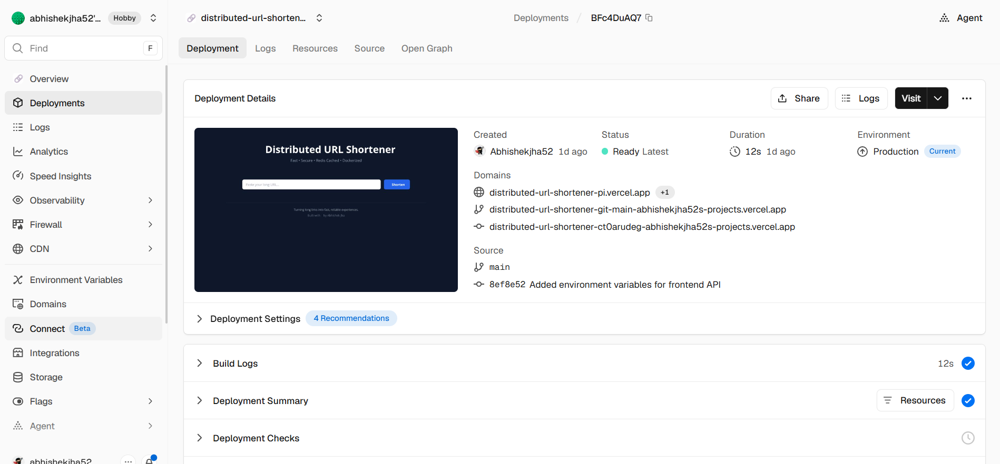
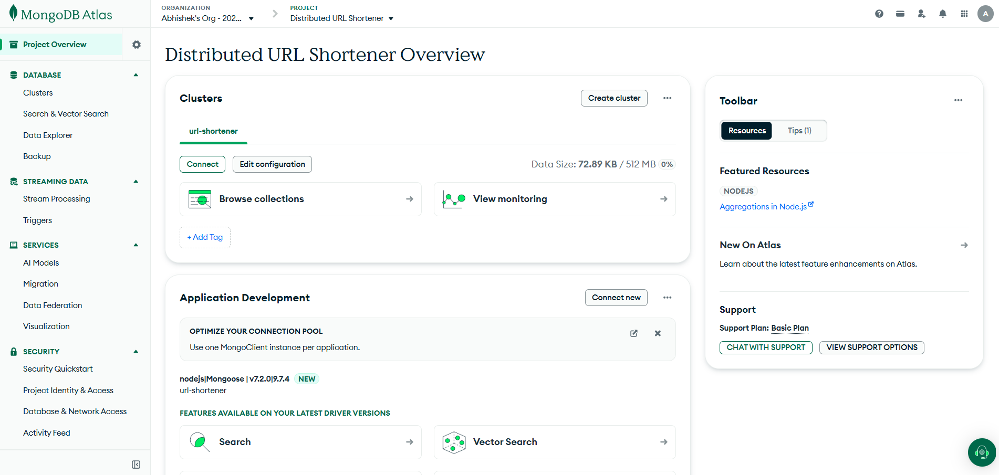
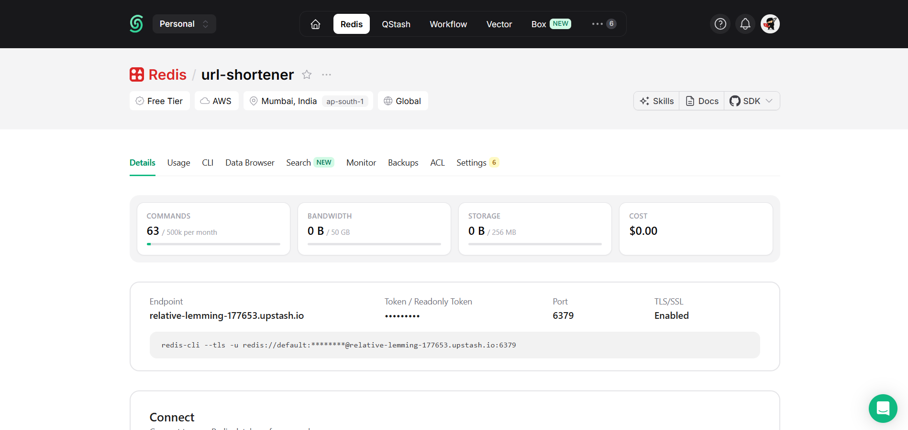

# 🚀 Distributed URL Shortener


A **production-ready distributed URL shortening service** built with **TypeScript**, **Express.js**, **MongoDB**, **Redis**, **Docker**, and **Swagger**.

Designed using scalable backend engineering principles including layered architecture, Redis cache-aside strategy, centralized error handling, request validation, and containerized deployment.

---

## 📸 Demo




## 🔗 Quick Links

| Resource | Link |
|----------|------|
| 🌐 Live Application | https://distributed-url-shortener-pi.vercel.app |
| 🚀 Backend API | https://distributed-url-shortener-pwh5.onrender.com |
| 📚 Swagger Docs | https://distributed-url-shortener-pwh5.onrender.com/api-docs |
| 💻 GitHub Repository | https://github.com/Abhishekjha52/distributed-url-shortener |

## ✨ Overview

This project demonstrates how a production-grade URL shortening service can be built using modern backend technologies and clean software architecture.

Unlike a basic CRUD application, this project focuses on:

- Clean Layered Architecture
- Repository Pattern
- Service Layer
- Redis Cache-Aside Strategy
- Click Analytics
- Dockerized Deployment
- Swagger API Documentation
- TypeScript Best Practices
- Global Error Handling
- Request Validation with Zod

The application generates short URLs, redirects users to the original destination, tracks click analytics, and uses Redis to significantly reduce database lookups for frequently accessed URLs.

---

## 🛠 Tech Stack

| Category | Technologies |
|-----------|--------------|
| Language | TypeScript |
| Runtime | Node.js |
| Framework | Express.js |
| Database | MongoDB |
| Cache | Redis |
| Validation | Zod |
| API Docs | Swagger |
| Containerization | Docker & Docker Compose |
| Frontend | React + Vite + Tailwind CSS |

---

## ⭐ Key Features

- Create short URLs
- Redirect using short URLs
- Track click analytics
- Redis cache-aside implementation
- MongoDB persistence
- Repository Pattern
- Service Layer Architecture
- Dockerized environment
- Swagger API documentation
- Global error handling
- Request validation with Zod
- Fully typed with TypeScript

---

## 🏗️ System Architecture

```text
                 User
                  │
                  ▼
      React Frontend (Vercel)
                  │
           REST API Request
                  │
                  ▼
     Express Backend (Render)
                  │
         ┌────────┴────────┐
         ▼                 ▼
 Upstash Redis        MongoDB Atlas
    (Cache)            (Database)
         │                 │
         └────────┬────────┘
                  ▼
            URL Analytics
```

---

## 🔄 Request Flow

### URL Creation

Client
→ Express API
→ Validation (Zod)
→ Service Layer
→ Repository Layer
→ MongoDB
→ Return Short URL


### URL Redirection

Client

↓

Redis Cache

↓

Cache Hit
↓

Redirect

OR

↓

Cache Miss

↓

MongoDB

↓

Save into Redis

↓

Redirect

---

## 📂 Project Structure

```text
distributed-url-shortener/

├── frontend/                 # React + Vite frontend
│
├── src/
│   ├── config/
│   ├── controllers/
│   ├── docs/
│   ├── errors/
│   ├── middleware/
│   ├── models/
│   ├── repositories/
│   ├── routes/
│   ├── services/
│   ├── types/
│   ├── utils/
│   ├── validations/
│   ├── app.ts
│   └── server.ts
│
├── Dockerfile
├── docker-compose.yml
├── package.json
└── README.md
```

---

## ⚙️ Installation

### 1. Clone the repository

```bash
git clone https://github.com/Abhishekjha52/distributed-url-shortener.git
cd distributed-url-shortener
```

### 2. Install backend dependencies

```bash
npm install
```

### 3. Install frontend dependencies

```bash
cd frontend
npm install
cd ..
```

### 4. Configure environment variables

Create a `.env` file inside the project root.

```env
PORT=5000

MONGODB_URI=mongodb://localhost:27017/url-shortener

REDIS_URL=redis://localhost:6379

BASE_URL=http://localhost:5000

```

### 5. Start the backend

```bash
npm run dev
```

### 6. Start the frontend

```bash
cd frontend
npm run dev
```

---

## 🐳 Docker Setup

The entire application can be started using Docker Compose.

### Build the containers

```bash
docker compose up --build
```

### Start in detached mode

```bash
docker compose up -d
```

### Stop the containers

```bash
docker compose down
```

### View logs

```bash
docker compose logs -f
```

The following services will start automatically:

- Express Backend
- MongoDB
- Redis

---

## ☁️ Deployment

| Component | Platform |
|-----------|----------|
| Frontend | Vercel |
| Backend | Render |
| Database | MongoDB Atlas |
| Cache | Upstash Redis |

---

## 📚 API Documentation

Swagger UI is available after starting the backend.

### Local

```
http://localhost:5000/api-docs
```

### Production

```
https://distributed-url-shortener-pwh5.onrender.com/api-docs
```

The API documentation includes:

- URL Creation
- URL Redirection
- URL Analytics
- Request/Response schemas

---

## 📮 API Endpoints

| Method | Endpoint | Description |
|---------|----------|-------------|
| POST | `/api/v1/urls` | Create a short URL |
| GET | `/api/v1/urls/{shortCode}` | Redirect to original URL |
| GET | `/api/v1/urls/details/{shortCode}` | Fetch URL analytics |

---

## 📷 Screenshots

### 🖥️ Frontend Home



---

### 🔗 Short URL Generated



---

### 📚 Swagger API Documentation



---

### ☁️ Backend Deployment (Render)



---

### ▲ Frontend Deployment (Vercel)



---

### 🍃 MongoDB Atlas



---

### ⚡ Upstash Redis



---

## 🚀 Performance & Scalability

This project incorporates several techniques commonly used in production backend systems.

### Redis Cache-Aside Strategy

- Frequently accessed URLs are served directly from Redis.
- Reduces MongoDB reads.
- Improves response time.
- Decreases database load.

### Indexed Database Queries

- MongoDB indexes the `shortCode` field.
- Enables fast URL lookups.

### Layered Architecture

The application follows a clean layered architecture:

- Controllers
- Services
- Repositories
- Database

This separation improves maintainability and testability.

### Validation

Incoming requests are validated using **Zod** before reaching the business logic.

### Error Handling

A centralized error middleware ensures consistent API responses.

---

## 🤝 Contributing

Contributions, issues, and feature requests are welcome.

Feel free to fork the repository and submit a pull request.

---

## 📄 License

This project is licensed under the MIT License.

---

## 👨‍💻 Author

**Abhishek Jha**

- 💼 LinkedIn: https://www.linkedin.com/in/abhishekjha5201/
- 🐙 GitHub: https://github.com/Abhishekjha52


> This project was built as a backend engineering and system design portfolio project, demonstrating production-ready software architecture and scalable API design.
